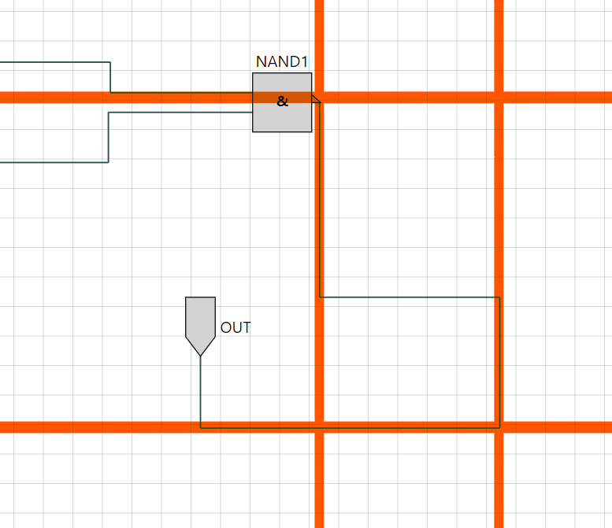
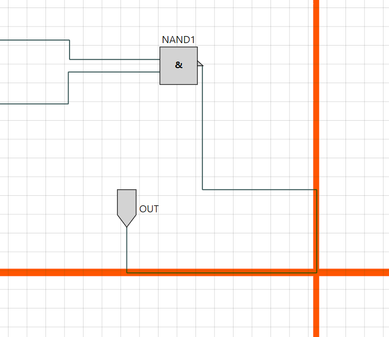
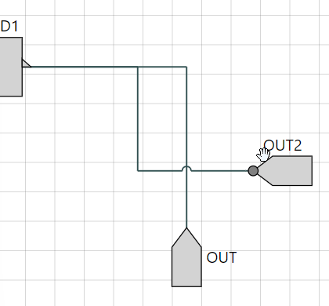
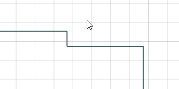

# Group 8 - Analysis Report

This document provides a description and analysis for notable algorithms used in our improvements of the ISSIE DrawBlock.

* [Autorouting](./ReadMeCodeAnalysis.md#autorouting)
* [Segment stickiness](./ReadMeCodeAnalysis.md#segment-stickiness)
* [Placing of ports](./ReadMeCodeAnalysis.md#placing-of-ports)

<br/>

## Autorouting

### Declaration and arguments

The auto-routing functionality is implemented inside the `makeInitialSegmentsList` that is declared as follows:

```fsharp
let makeInitialSegmentsList connId (startPort: XYPos) (endPort: XYPos) (startSymbolRotation: int) (endSymbolRotation: int) (startSymbolFlip: bool) (endSymbolFlip: bool) (startPortOnAltSide: bool) (endPortOnAltSide: bool) : Segment list
```

It takes multiple arguments of various types:
 - `connId` (ConnectionId): The Id of the wire that is being autorouted.
 - `startPort` (XYPos): The coordinates of the port at the start of the wire.
 - `endPort` (XYPos): The coordinates of the port at the end of the wire.
 - `startSymbolRotation` (integer): A value in the range [0; 360) that describes the **clockwise** rotation of the symbol at the start of the wire.
 - `endSymbolRotation` (integer): Similarly as `startSymbolRotation`, but for the symbol at the end of the wire.
 - `startSymbolFlip` (boolean): A boolean describing if the symbol at the start of the wire is flipped or not.
 - `endSymbolFlip` (boolean): Similarly as `startSymbolFlip`, but for the symbol at the end of the wire.
 - `startPortOnAltSide` (boolean): A boolean describing if the starting port is on the alternative side of the symbol at the start of the wire.
 - `endPortOnAltSide` (boolean): Similarly as `startPortOnAltSide`, but for the end port of the wire.

 All those arguments are then used to compute the characteristics and requirements of the wire's segments to be generated.

 ### Computing the port orientations

 The length of the sticks at each end of the wire is first computed using a similar way as the original Issie implementation to generate simple wires.

 Then, the rotation of the start and end ports of the wire is computed. This is based on the rotation of the Symbol that each port is on, as well as wether the Symbol is flipped, or if the ports are on the 'alternative side' of the Symbol (for a more detailed explanation of alternatives sides, please refer to [this documentation](./appendix/alt_side.md)):

 ```fsharp
let startPortRotation = 
        match startPortOnAltSide, startSymbolFlip with
        // If the startPort is on the alternative side then it means that 
        // it is on the side to the right of where it would've been normally (so an additional rotation of -90)
        // We use a wildcard here because if a port is at the top of a symbol that points to the left (for example),
        // it is not sensitive to flips
        | true, _       -> makeInRangeRotation (startSymbolRotation - 90)
        // Normal orientation
        | false, false  -> startSymbolRotation
        // If the symbol is flipped, the ports are pointing backwards
        | false, true   -> makeInRangeRotation (startSymbolRotation + 180)
```

The implementation for the start port is given above and works as follows: it is a match statement on a 2-tuple of booleans. The first on is if the start port is on the alternative side or not, and the second one is if the start symbol is flipped of not.
If a symbol is on the alternative side, it will not be affected by flips as flips only occur along the axis of orientation of the component, so we can use a wild card for the second boolean and compute its rotation from the rotation of the symbol: `startSymbolRotation - 90` because it is on the next counter-clockwise side.
If on the other hand, the port is on its regular side, then the second boolean tells us if the rotation is shifted by `180` to point backwards in case of a flipped symbol. *It is important to note here that the rotation of a Symbol and whether or not it is flipped are two parameters that are handled independantly.*

The computation for `endPortRotation` is very similar, except an offset of `180` is always applied to the rotation of the end Symbol as input ports are always pointing opposite to the orientation of the Symbol.

Both computation rely on a helper function called `makeInRangeRotation` that takes the modulo of the input value by 360 and shifts it to always be in the positive range (the F# modulo operator returns a value of the same sign as the input value, which is incompatible with the rotation restrictions).


### Normalizing the requirements for the wire to be generated

Given the rotation of the ports, the overall rotation of the wire is set to be the same as the rotation of the start port:
```fsharp 
    // Overall rotation of the wire
    let wireRotation = startPortRotation
```

This is then used in a match statement to normalize the distances over both the X and Y axis to be covered by the wire:

```fsharp
    // Get the real/actual difference between the ports over the X and Y axis
    let differenceInX, differenceInY = (endPort.X - startPort.X), (endPort.Y - startPort.Y) 

    // Get the NORMALIZED differences between the X and Y coordinates of the ports
    // i.e. assuming the Input port points to the right, towards the positive X
    let diffX, diffY =
        match wireRotation with
        | 0     -> differenceInX, differenceInY
        | 90    -> differenceInY, - differenceInX
        | 180   -> - differenceInX, - differenceInY
        | 270   -> - differenceInY, differenceInX
        // edge case: should not happen
        | _     -> differenceInY, differenceInX
```

This computation essentially shifts the coordinate system so that the start port of the wire is always rotated towards the positive X.  

The end port's rotation can then also be normalized to fit into this new coordinate system:

```fsharp
    // Get the NORMALIZED rotation of the output port
    // i.e. assuming the Input port points to the right, towards the positive X
    let normalizedEndPortRotation = makeInRangeRotation (endPortRotation - wireRotation)
```

### Generating the list of segments lengths

After normalization, all possible normalized wire configuration can be broken down into 12 simple cases that are matched on a 3-tuple of parameters:

```fsharp
    /// Generate a list of segment lengths for the wire to go from the normalized startPort to the normalized endPort
    let generatelengthList (normalizedEndPortRotation: int) (s: float) (diffX: float) (diffY: float) : float list = 
        match (normalizedEndPortRotation, (diffX >= 0.0), (diffY >= 0.0)) with
        // Same orientation
        | 0, true, _        -> [s; 0.0; diffX; diffY; 0.0; 0.0; -s]
        | 0, false, _       -> [s; 0.0; 0.0; diffY; diffX; 0.0; -s]
        // Opposite orientation
        | 180, true, _      -> [s; 0.0; (diffX - 2.0 * s)/2.0; diffY; (diffX - 2.0 * s)/2.0; 0.0; s]
        | 180, false, _     -> [s; diffY/2.0; (diffX - 2.0 * s); diffY/2.0; 0.0; 0.0; s]
        // Perpendicular orientation: if startPort points to the right, endPort points down
        | 90, true, true    -> [s; 0.0; (diffX - s)/2.0; (diffY + s); (diffX - s)/2.0; 0.0; 0.0; -s]
        | 90, true, false   -> [s; 0.0; (diffX - s); (diffY + s); 0.0; 0.0; 0.0; -s]
        | 90, false, true   -> [s; 0.0; 0.0; (diffY + s); (diffX - s); 0.0; 0.0; -s]
        | 90, false, false  -> [s; 0.0; 0.0; (diffY+s)/2.0; (diffX-s); (diffY+s)/2.0; 0.0; -s]
        // Perpendicular orientation: if startPort points to the right, endPort points up
        | 270, true, true   -> [s; 0.0; (diffX - s); (diffY - s); 0.0; 0.0; 0.0; s]
        | 270, true, false  -> [s; 0.0; (diffX - s)/2.0; (diffY - s); (diffX - s)/2.0; 0.0; 0.0; s]
        | 270, false, true  -> [s; 0.0; 0.0; (diffY - s)/2.0; (diffX - s); (diffY - s)/2.0; 0.0; s]
        | 270, false, false -> [s; 0.0; 0.0; (diffY - s); (diffX - s); 0.0; 0.0; s]
        // Edge case that should never happen
        | _                 -> [s; 0.0; 0.0; 0.0; 0.0; 0.0; s]


    // Generate the list of segments length
    let lengthList = generatelengthList normalizedEndPortRotation s diffX diffY
```

This function seperates all possible combinations/arrangements of wires into several categories based on the normalized rotation of the end port, and whether the normalized distances to cover are negative or positive over both the X and Y axis. It then returns a simple length list that describes a basic wire shape to fulfill the requirements of the wire (i.e. join the two ports together).

### Converting the list of segments lengths back into a regular Segment list

The generated list of lengths of segments is then mapped into a list of `RotationInvariantSeg` before being converted back into a regular `Segment list` as required by the function signature:

```fsharp
    lengthList
    // Map the generated segment lengths to a list of RISegs
    |> List.mapi buildRiSegListFromLengths
    // Convert those RISegs back into a regular Segment list
    |> convertRISegsToSegments connId startPort wireRotation
```

Those two convertions rely respectively on the `buildRiSegFromLength` function, that maps a length into a `RotationInvariantSeg` as detailed bellow, and the `convertRISegsToSegments` general helper function, that is explained in [this document](./appendix/helper_convertRISegsToSegments.md).

```fsharp
    /// Build an RISeg from a given length and index
    let buildRiSegFromLength (index:int) (length:float) : RotationInvariantSeg = {
        Id = SegmentId(JSHelpers.uuid())
        Length= length
        HostId  = connId;
        JumpCoordinateList = [];
        Draggable = 
            if (index = 0 || index = lastIndex) then false else true
        Autorouted = true
    }
```

### Note on defaulting back from Partial routing to Autorouting

Partial routing allows the end of any manually routed segments to remain fixed when moving the Symbol at the end of a Wire.
However, there are some cases where the move done by the user cannot preserve the partially routed state of the Model.
In the old Issie, whenever the Symbol moved crossed the axis of the fixed end of the manually routed segment, or whenever it crossed the axis of the other end of the wire (i.e. where the other port is).

This behaviour has been simplified and improved in our implementation of the Issie DrawBlock by removing the latter case. This is because the algorithm for partial routing as it is currently implemented only relies on the fixed end of the manually routed segment, and is therefore not influenced by where the other end of the wire is.

This leads to the change in restrictions for moving a component at the end of a partially routed wire illustrated bellow:

* Old Issie implementation, the boundaries that the OUT Symbol cannot cross to preserve partial routing are drawn in red:



* New simplified implementation, the boundaries that the OUT Symbol cannot cross to preserve partial routing are drawn in red:



<br/>

## Segment stickiness



Segment stickiness, both locally to parallel segments within a same Wire, and globally with all segments of wires coming out from the same port, is implemented by the function `alignToCloseParallelSegments` that is called in the `moveSegment` function after a segment is moved and redundant segments have been removed:

```fsharp
            // Rebuild the list of segments of the wire with the updated segments at the right indexes
            let newSegments =
                wire.Segments[.. index-2] @ [newPrevSeg; newSeg; newNextSeg] @ wire.Segments[index+2 ..]
                // Remove all redundant segments that may have been created by the move
                |> removeRedundantSegments index
                // Align the moved segment with any parallel segments in the wire that are close to it
                |> alignToCloseParallelSegments index wire.OutputPort allModelWires
```

It is the last function called before the wire with its new `Segment list` is returned, and therefore performs the last adjustments on the Wire after a move.

```fsharp
            // Update the list of segments in the wire object, and return it
            {wire with Segments = newSegments})
```

### Declaration and arguments

Its signature is the following:

```fsharp
let alignToCloseParallelSegments (index: int) (currentWireOutputPort : OutputPortId) (allModelWires: Wire list) (segs: Segment list) : Segment list
```

And it takes in the following arguments :
 - `index` (integer): The index of the segment that was moved.
 - `currentWireOutputPort` (OutputPortId): The ID of the output port at the start of the wire.
 - `allModelWires` (Wire list): All the `Wires` present in the current model.
 - `segs` (Segment list): The current list of segments, after the move has been done and prior adjustements have been carried.

And it returns a list of `Segments`.

### Getting the neighbouring Segments that the moved segment could potentially align itself to

Firstly, the `Segment` that is being moved is retrieved from the list of `Segments` of the current wire:

```fsharp
    // Get the segment that has just been moved
    let segMoved = segs[index]
```

*Note: The function body then defines several local helper functions that will be described as they are used in the implementation.*

Then, all segments that are in wires coming out from the same output port are concatenated into a list:

```fsharp
let (segmentsFromSameOutputPort: Segment list) = 
        allModelWires
        // Filter all the wires coming out of the same output port
        |> List.filter (fun (wire: Wire) -> (wire.OutputPort = currentWireOutputPort))
        // Extract all their segments into a single Segment list
        |> List.collect (fun (wire: Wire) -> wire.Segments)
```

This is done by filtering the `Wires` in the `Model` that have the same `OutputPort` (that is of type `OutputPortId`), and then extracting and concatenating all their segment lists.

Then, those segments are filtered according to multiple criterias:

```fsharp
   let (alignmentMatchSegs: Segment list) = 
        segmentsFromSameOutputPort
        // 1. Filter the segments that are parallel to the segment moved
        |> List.filter (fun seg -> ((getOrientation seg) = (getOrientation segMoved)))
        // 2. Filter the segments that are on the same "level" as the segment moved
        |> List.filter (fun seg -> areSegsOnSameLevel segMoved seg)                                             
        // 3. Filter the segments that have their end (or start) close to the start (or end) of the segment moved
        |> List.filter (fun seg -> (areXYPosClose (getEndPoint seg) segMoved.Start)
                                    || (areXYPosClose seg.Start (getEndPoint segMoved))
                                    || (areXYPosClose seg.Start segMoved.Start)
                                    || (areXYPosClose (getEndPoint seg) (getEndPoint segMoved)) )
        // 4. Filter out the current segment moved from this list
        |> List.filter (fun seg -> (seg.Id <> segMoved.Id))
```

 1. They need to be parallel (i.e. of the same Orientation) to the segment being moved in order to be valid

 2. They need to be "on the same level" as the segment being moved. This is checked using the `areSegsOnSameLevel` function that takes in two segments and checks, according to their rotation, if they are on the same relevant axis:

 ```fsharp
     /// Check if two segments are on the same level
    let areSegsOnSameLevel (seg1: Segment) (seg2: Segment) : bool = 
        if ((abs ((getNormalCoord seg2) - (getNormalCoord seg1))) <= stickynessThreshold)
        then true
        else false
 ```
 Where `stickynessThreshold` is a parameter constant that will further be explained in a later section.
 This function utilizes the helper function `getNormalCoord` that returns their coordinates over their normal axis.

 ```fsharp
     /// Returns the coordinate along the normal axis of a segment
    let getNormalCoord (seg: Segment) : float =
        match getOrientation seg with
        | Horizontal -> seg.Start.Y
        | Vertical   -> seg.Start.X
        | _          -> 0.0
 ```

 3. They need to be physically close to the segment being moved: i.e. either have their start or end close to the start or end of the moved segment. Two positions are determined to be close according to the following helper function:

 ```fsharp
    /// Check if the end of seg1 is close to the start of seg2
    let areXYPosClose (pos1: XYPos) (pos2: XYPos) : bool = 
        if (((abs (pos1.X - pos2.X)) <= stickynessThreshold)
            && ((abs (pos1.Y - pos2.Y)) <= stickynessThreshold))
        then true
        else false
 ```

 Where `stickynessThreshold` is also used.

 4. Finally the current segment being moved is excluded from the list of possible alignment matches, as it can't be aligned to itself.

### Algorithm configuration constants

The previously described helper functions used the `stickynessThreshold` configuration constant.
This threshold defines how close two segments need to be in order to lead to a possible alignment of the two segments.
It is completely arbitrary but should remain relatively small to prevent unwanted alignments from happening.

This configuration constant is defined, along with other ones, in the `RoutingConfig` module declared at the top of the [BusWire.fs](../src/Renderer/DrawBlock/BusWire.fs) file:

```fsharp
    module RoutingConfig =

        /// Threshold to determine if a segment is aligned with a stick, i.e. on the same "level" as a stick.
        /// (The bigger, the more forgiving it is.)
        /// Used to enforce a safe distance between a segment and a port.
        let onStickAxisThreshold : float = 2.0

        /// Threshold to determine if a segment is aligned with another segment, i.e. on the same "level" as the other segment.
        /// (The bigger, the more forgiving it is.)
        /// Used to determine if two opposite segments are close enough and should cancel each other.
        let onRedundantSegmentAxisThreshold : float = 5.0

        /// Threshold to determine if a segment is aligned with another segment, i.e. on the same "level" as the other segment.
        /// (The bigger, the more forgiving it is.)
        /// Used to align/snap/stick two segments that are on the same level together.
        let stickynessThreshold : float = 5.0
```

Currently the threshold is set to `5.0`, and it looks like this:



### Aligning the matched segments together
 

<br/>

## Placing of ports 

The X and Y coordinates for each port is relative to the top-left corner of the symbol.
The X position is set according to the component type, the port type and whether the symbol is flipped or not.
Additionally, custom logic has been implemented to deal with the select ports of the Mux2 and Mux4 components.
```fsharp
let (ports, posX) =
        match port.PortType, symbol.SymbolCharacteristics.flip, symbol.Component.Type, port.PortNumber with
        | PortType.Input, _, Mux2, Some 2 -> symbol.Component.InputPorts, 30.0
        | PortType.Input, _, Mux4, Some 4 -> symbol.Component.InputPorts, 60.0
        | PortType.Output, _, ExtractWire(w,a,b), Some 0 -> symbol.Component.OutputPorts, float(symbol.Component.W)/2.0
        | PortType.Input, false, _, _ -> symbol.Component.InputPorts, 0.0
        | PortType.Input, true, _, _ -> symbol.Component.InputPorts, float(symbol.Component.W)
        | PortType.Output, false, _, _ -> symbol.Component.OutputPorts, float(symbol.Component.W)
        | PortType.Output, true, _, _ -> symbol.Component.OutputPorts, 0.0
```
The Y position is set according to the number of ports on a specific side of the component, ensuring each port is spaced out evenly. Custom logic has been implemented to deal with the select ports of the Mux2 and Mux4 components and with the output port of the ExtractWire.

```fsharp
 let posY = 
        match symbol.Component.Type, port.PortNumber, port.PortType with
        | Mux2, Some 2, PortType.Input-> 80.0
        | Mux4, Some 4, PortType.Input-> 160.0
        | ExtractWire(w,a,b), Some 0, PortType.Input-> float(symbol.Component.H)
        | Mux2, _, PortType.Input -> (float(symbol.Component.H)) * ((index + gap)/(float(ports.Length - 1) + 2.0*gap - 1.0))
        | Mux4, _, PortType.Input -> (float(symbol.Component.H)) * ((index + gap)/(float(ports.Length - 1) + 2.0*gap - 1.0))
        | _ -> (float(symbol.Component.H)) * ((index + gap)/(float(ports.Length) + 2.0*gap - 1.0))
```

<br/>
