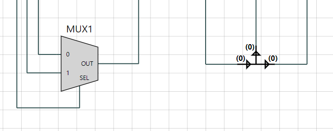

 ## Note on the alternative sides of a Symbol

 The 'alternative side' of a Symbol is the next counter-clockwise side of the Symbol after the regular side that the port is supposed to be on: for example, a Symbol facing to the right will have its input ports on the left and its output port on the right, and the alternative side for the input and output ports would respectively be the bottom and top sides of the Symbol.

 Two good examples of Symbol utilizing this property are the `MUX2` and the `Bus Extract`: the `MUX2` has its `sel` input port on the bottom, and the `Bus Extract` has one of its output port on the top, as is illustrated bellow.

